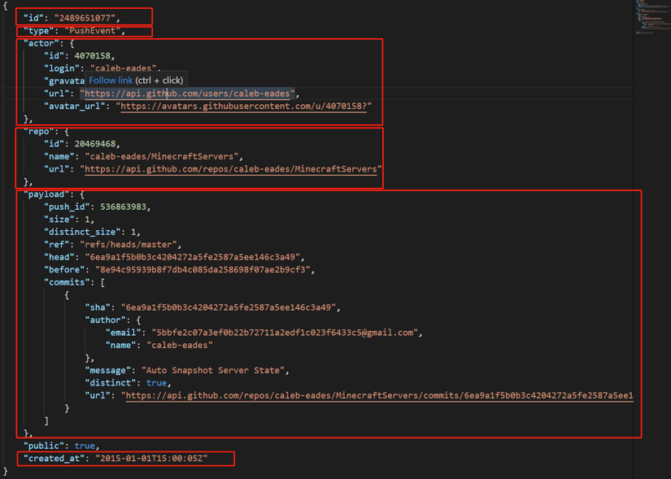

# Data Description

## GitHub 事件日志

### 数据源

该数据来源于 [GH Archive](https://www.gharchive.org/)，这是一个用于记录和归档 GitHub 事件日志的项目。归档的数据为 GitHub 事件日志的 JSON 格式数据，主要包含 6 个重要的字段： `id`, `type`, `actor`, `repo`, `payload`, `created_at`。



### 数据库

为了满足在大规模数据上的高速查询的需求，我们将 GitHub 日志数据解析为结构化数据并导入了开源的列存储高性能实时分析数据库 [ClickHouse](https://clickhouse.tech/) 中，目前该项目使用的 Clickhouse 服务器版本为 20.8.7.15。

### 数据结构

`Clickhouse` 服务器中数据表的结构如[数据描述表](https://github.com/X-lab2017/open-digger/blob/master/docs/assets/data_description.csv)所示。该表中包含了超过 120 行数据列，可以根据该表决定自己想要分析的数据和分析方法。

### 数据库用户指南

Clickhouse SQL 的详细用法，请参阅 [Clickhouse SQL 文档](https://clickhouse.tech/docs/en/)。

### 示例

以下是较简单的一个从 Clickhouse 数据库查询数据的 SQL 语句。也可以在全域分析和案例分析的 SQL 组件中找到更多示例。

* 某组织下的 Pull Request 审阅评论数据

```
SELECT actor_id, actor_login, repo_id, repo_name, issue_id, action, created_at
FROM {database}.{table}
WHERE type='PullRequestReviewCommentEvent' AND repo_name LIKE '{org}/%'
ORDER BY created_at ASC
```
