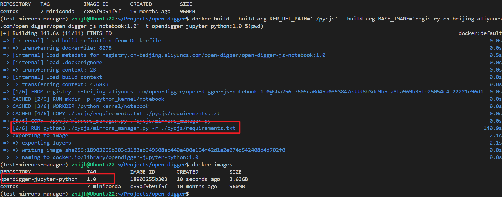
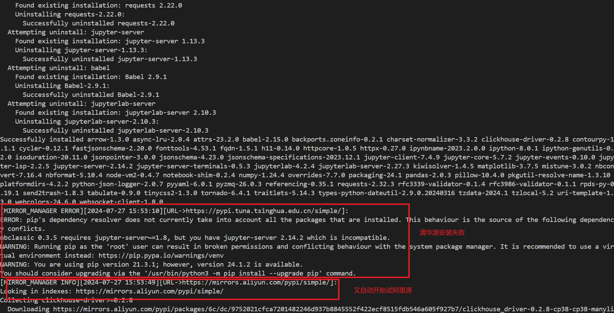
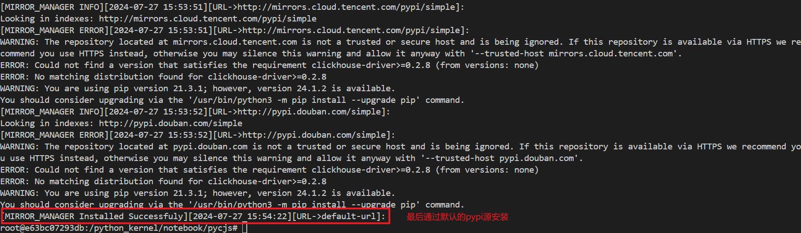
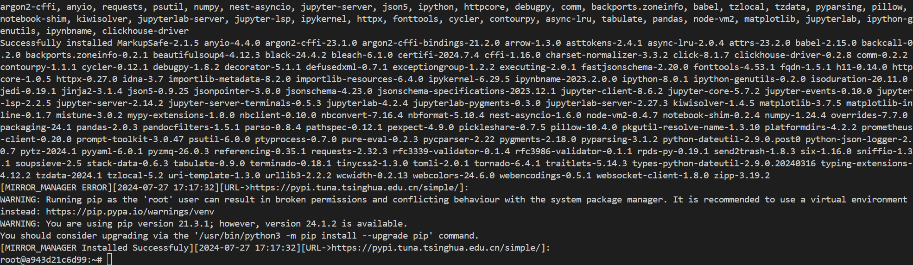

#  Mirror Source Management Tool

### 功能1：自动判断python包是否安装成功，若某个镜像源安装python包失败，则自动切换另一个镜像源进行尝试，如果所有国内源都安装失败，则尝试使用pypi源
- 同过python脚本实现判断逻辑，首先通过开一个python子进程来执行pip安装命令，如果子进程有error返回，则认为是安装失败，否则认为是安装成功

### 功能2：将python包的安装日志（包括成功和错误信息）输出到dockerfile构建的控制台，并将完整日志保存在/root/mirrors_managers.log日志文件中
- 这有助于用户观察包安装失败的原因，从而更换镜像源

### 功能3：支持用户通过dockerfile传递镜像源，用户传递的镜像源将会被优先搜索
- 这样，用户就不需要手动修改mirrors_manager.py的代码，就可以配置镜像源

---------------------------------------------
--------------------------------------------
--------------------------------------------

### 测试结果1：修改后的dockerfile能够成功构建
- 修改后的dockerfile通过mirrors_manager.py来安装python包，而不是直接通过
`RUN pip install -r ${KER_REL_PATH}/requirements.txt -i https://pypi.tuna.tsinghua.edu.cn/simple/` 来指定特定的镜像源来安装
```dokcerfile
RUN python3 ${KER_REL_PATH}/mirrors_manager.py -r ${KER_REL_PATH}/requirements.txt
```
- 构建结果如下，成功构建了镜像：


### 测试结果2：查看日志文件
#### CASE1
- 清华源安装失败

- Pypi源安装成功

#### CASE2
- 清华源安装成功


### 测试结果3：用户通过向dockerfile传递参数来添加镜像源，或者调整镜像源的搜索顺序
- 使用`--build-arg MIRROE_URL_LIST`来传递镜像源，可以传递多个镜像源，用`|`隔开，如下例子所示，mirrors_manager会优先使用阿里源安装包
```shell
docker build --build-arg KER_REL_PATH='./pycjs' --build-arg BASE_IMAGE='registry.cn-beijing.aliyuncs.com/open-digger/open-digger-js-notebook:1.0' --build-arg MIRROE_URL_LIST='https://mirrors.aliyun.com/pypi/simple/|https://pypi.tuna.tsinghua.edu.cn/simple/'  -t opendigger-jupyter-python:1.0 $(pwd)
```
