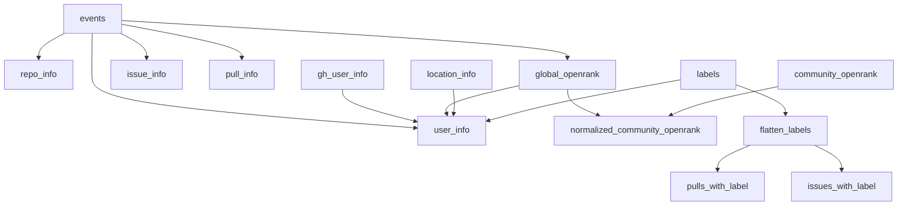

# OpenDigger ClickHouse 数据库表结构

OpenDigger 使用 **ClickHouse** 作为核心数据存储，数据库名固定为 **`opensource`**。所有开源指标（OpenRank、活跃度、协作网络等）都从底层事件数据计算而来。

平台维度统一用 `platform` 字段标识，支持多平台：**GitHub、Gitee、GitLab、AtomGit**（字段值为对应平台名，如 `'GitHub'`、`'Gitee'`、`'AtomGit'`）。

> 编写查询时务必带上 `platform` 条件，绝大多数表的排序键都以 `platform` 或包含 `platform` 来过滤。

## 1. 核心表总览

| 表名 | 用途 | 引擎 |
|---|---|---|
| `events` | **最核心**，所有平台事件日志，全部指标的数据源 | ReplacingMergeTree(from_api) |
| `repo_info` | 仓库元信息 | ReplacingMergeTree |
| `user_info` | **用户信息视图**（标准化国家/省市，推荐查询用） | MergeTree（物化视图） |
| `global_openrank` | 全局 OpenRank 排名 | MergeTree |
| `community_openrank` | 社区级贡献排名（Neo4j 图算法计算） | MergeTree |
| `normalized_community_openrank` | **归一化社区贡献度**（全域横向可比） | MergeTree |
| `normalized_community_openrank_with_bot` | 上者的含 Bot 变体 | MergeTree |
| `export_repo` | 待导出静态文件的仓库列表 | ReplacingMergeTree |
| `export_user` | 待导出静态文件的用户列表 | ReplacingMergeTree |
| `labels` | 分层标签体系 | ReplacingMergeTree |
| `location_info` | 用户位置地理编码结果 | ReplacingMergeTree |
| `issue_info` | AI 生成的 Issue 质量分析 | ReplacingMergeTree |
| `pull_info` | AI 生成的 PR 质量分析 | ReplacingMergeTree |
| `pull_diff` | 缓存 PR diff 内容 | ReplacingMergeTree |

## 2. events 表（最核心）

- **用途**: 存储所有平台的事件日志，是所有指标计算的基础数据源。
- **引擎**: `ReplacingMergeTree(from_api)` —— 以 `from_api` 作为版本列去重。
- **分区**: `toYYYYMM(created_at)`（按月分区）。
- **主键/排序键**:
  `(platform, org_id, repo_id, actor_id, type, action, toYear(created_at), toYYYYMM(created_at))`
- **type 枚举值（12 种）**:
  `CommitCommentEvent`、`ForkEvent`、`ReleaseEvent`、`IssueCommentEvent`、`IssuesEvent`、`PullRequestEvent`、`PullRequestReviewCommentEvent`、`PushEvent`、`WatchEvent`、`PullRequestReviewEvent`、`IssuesReactionEvent`、`IssueCommentsReactionEvent`
- **action 常见值**: `opened`、`closed`、`created`、`started`、`added`、`published` 等（不同 type 对应不同 action）。

### 主要字段分组

events 表有 80+ 字段，按事件类型组织。**完整字段列表见 [events-table-reference.md](events-table-reference.md)**。分组概览：

- **基础字段**：`platform`、`type`、`action`、`actor_id/login`、`repo_id/name`、`org_id/login`、`created_at`
- **Issue/PR 通用字段**：`issue_id`、`issue_number`、`issue_title`、`body`、`issue_labels`、`issue_author_*`、`issue_assignee*`、时间戳等
- **Issue Comment 字段**：`issue_comment_*`
- **PR 特有字段**：`pull_commits`、`pull_additions`、`pull_deletions`、`pull_merged`、`pull_merged_*`、`pull_base_ref`、`pull_head_*` 等
- **PR Review 字段**：`pull_review_state`、`pull_review_id`、`pull_review_author_association`
- **PR Review Comment 字段**：`pull_review_comment_*`
- **Push 字段**：`push_id`、`push_size`、`push_distinct_size`、`push_ref`、`push_head`、`push_commits`
- **Fork 字段**：`fork_forkee_*`
- **Release 字段**：`release_*`
- **Commit Comment 字段**：`commit_comment_*`
- **元数据**：`from_api`（0=日志采集，1=API采集）

> 关键提示：events 表很大，查询务必加 `platform` + 时间范围（`created_at` 或 `toYYYYMM(created_at)`）+ `type` 条件以命中分区与排序键。同一记录可能因采集方式不同而存在多版本，统计精确值时按需用 `argMax(..., created_at)` 或子查询去重。对于仓库、组织、开发者的查询，除必要情况外尽量使用平台 ID 为条件查询。

## 3. repo_info 表

- **用途**: 仓库元信息（主要来自 GitHub API）。
- **引擎**: `ReplacingMergeTree`
- **排序键**: `(platform, id, updated_at)`

| 字段 | 类型 | 说明 |
|---|---|---|
| platform | LowCardinality(String) | 平台 |
| id | UInt64 | 仓库 ID |
| status | Enum('normal'=1, 'not_found'=2) | 抓取状态 |
| updated_at | DateTime | 更新时间（版本列） |
| description | String | 仓库描述 |
| default_branch | LowCardinality(String) | 默认分支 |
| homepage_url | String | 主页 URL |
| isFork | UInt8 | 是否 Fork 仓库 |
| primary_language | String | 主语言 |
| license | LowCardinality(String) | 许可证 |
| languages | Array(LowCardinality(String)) | 语言列表 |
| license_spdx_id | LowCardinality(String) | SPDX 许可证 ID |
| topics | Array(String) | 主题标签 |
| readme_text | String | README 文本 |
| created_at | DateTime | 仓库创建时间 |

## 4. user_info 视图（用户查询首选）

- **用途**: 标准化用户信息视图，国家/省市已通过 `labels`（Division 标签）标准化，**可直接用于按地域聚合查询**。
- **类型**: 物化视图（`REFRESH EVERY 3 HOUR`）
- **引擎**: `MergeTree()`
- **排序键**: `(id, platform)`
- **数据来源**: `gh_user_info`（GitHub 原始用户表）+ `global_openrank`（取最新 login）+ `location_info`（地理编码）+ `labels`（Division-0/1 国家/省份标签匹配）

| 字段 | 类型 | 说明 |
|---|---|---|
| platform | LowCardinality(String) | 平台 |
| id | UInt64 | 用户 ID |
| login | String | 用户登录名（取最新） |
| bio | String | 简介 |
| email | String | 邮箱 |
| name | String | 姓名 |
| company | String | 公司 |
| twitter_username | String | Twitter 用户名 |
| location | String | 原始位置文本 |
| country_id | LowCardinality(String) | 国家标签 ID（如 `:divisions/China`） |
| country | LowCardinality(String) | 国家英文名（标准化） |
| country_zh | LowCardinality(String) | 国家中文名（标准化） |
| province_id | LowCardinality(String) | 省份标签 ID |
| province | LowCardinality(String) | 省份英文名（标准化） |
| province_zh | LowCardinality(String) | 省份中文名（标准化） |
| city | String | 城市 |

> 注意：`gh_user_info` 是 GitHub 平台原始用户表（含未标准化的 location 文本），一般情况下**不要直接查询** `gh_user_info`，而应查询 `user_info` 视图获取标准化后的地域信息。

## 5. global_openrank 表

- **用途**: 全局 OpenRank 排名，基于所有仓库的贡献行为计算。
- **引擎**: `MergeTree`
- **排序键**: `(repo_id, actor_id, org_id, platform, created_at)`

| 字段 | 类型 | 说明 |
|---|---|---|
| platform | LowCardinality(String) | 平台 |
| repo_id | UInt64 | 仓库 ID |
| repo_name | LowCardinality(String) | 仓库全名 |
| actor_id | UInt64 | 用户 ID |
| actor_login | LowCardinality(String) | 用户登录名 |
| org_id | UInt64 | 组织 ID |
| org_login | LowCardinality(String) | 组织名 |
| type | Enum('Repo'=1, 'User'=2) | 行类型 |
| created_at | DateTime | 月份时间（按月一条） |
| openrank | Float | OpenRank 值 |

## 6. community_openrank 表

- **用途**: 社区级贡献排名，通过 Neo4j 图算法计算。
- **引擎**: `MergeTree`
- **排序键**: `(repo_id, created_at)`

| 字段 | 类型 | 说明 |
|---|---|---|
| platform | LowCardinality(String) | 平台 |
| repo_id | UInt64 | 仓库 ID |
| repo_name | LowCardinality(String) | 仓库全名 |
| org_id | UInt64 | 组织 ID |
| org_login | LowCardinality(String) | 组织名 |
| actor_id | UInt64 | 用户 ID |
| actor_login | LowCardinality(String) | 用户登录名 |
| issue_number | UInt32 | 关联的 Issue/PR 编号 |
| created_at | DateTime | 月份时间 |
| openrank | Float | 社区 OpenRank 值 |
| refined | UInt8 | 是否为精炼结果 |

## 7. normalized_community_openrank 表（重点）

- **用途**: **归一化社区贡献度**，提供全域横向可比的归一化贡献度数据。
- **来源脚本**: `src/scripts/importNormalizedCommunityOpenrank.ts`
- **计算依据**: 基于 `events` + `global_openrank` + `community_openrank` 计算；当某仓库未计算社区 OpenRank 时，使用 activity（活跃度）作为兜底。
- **引擎**: `MergeTree()`
- **排序键**: `(repo_id, platform)`

| 字段 | 类型 | 说明 |
|---|---|---|
| platform | LowCardinality(String) | 平台 |
| repo_id | UInt64 | 仓库 ID |
| repo_name | LowCardinality(String) | 仓库全名 |
| org_id | UInt64 | 组织 ID |
| org_login | LowCardinality(String) | 组织名 |
| actor_id | UInt64 | 用户 ID |
| actor_login | LowCardinality(String) | 用户登录名 |
| openrank | Float | 归一化贡献度 |
| yyyymm | UInt32 | 年月（如 202501） |
| created_at | DateTime | 时间 |

**变体表 `normalized_community_openrank_with_bot`**：字段与上表完全一致，并在 `openrank` 之后额外包含一列 `is_bot UInt8`（是否为 Bot 账号）。排除 Bot 时查无 bot 表，需要含 Bot 数据时查 with_bot 表。

## 8. export_repo / export_user 表

标记需要导出到静态文件的对象（仓库 openrank > 5 或带标签的仓库）。

**export_repo** — 引擎 `ReplacingMergeTree`，排序键 `(id, platform)`：

| 字段 | 类型 | 说明 |
|---|---|---|
| id | UInt64 | 仓库 ID |
| platform | LowCardinality(String) | 平台 |
| repo_name | LowCardinality(String) | 仓库全名 |
| org_id | UInt64 | 组织 ID |

**export_user** — 引擎 `ReplacingMergeTree`，排序键 `(id, platform)`：

| 字段 | 类型 | 说明 |
|---|---|---|
| id | UInt64 | 用户 ID |
| platform | LowCardinality(String) | 平台 |
| actor_login | LowCardinality(String) | 用户登录名 |

## 9. labels 表

- **用途**: 分层标签体系，将仓库/组织/用户归类到 Project / Company / University / Foundation / Agency / Tech / Division 等类别。
- **引擎**: `ReplacingMergeTree`
- **排序键**: `id`

| 字段 | 类型 | 说明 |
|---|---|---|
| id | String | 标签 ID（如 `:companies/alibaba`） |
| type | LowCardinality(String) | 标签类型（如 `Company`、`Division-0`） |
| name | String | 名称 |
| name_zh | String | 中文名称 |
| description | String | 描述 |
| description_zh | String | 中文描述 |
| children | Array(String) | 子标签 ID 列表（构成层级） |
| platforms | Nested(name, type, orgs Array(UInt64), repos Array(UInt64), users Array(UInt64)) | 各平台下关联的组织/仓库/用户 |
| data | String | JSON 扩展数据（见下方说明） |

### labels.data 字段重要内容

对于国家级标签（`type = 'Division-0'`），`data` JSON 中包含重要的 `developers` 数组，记录了该国家在 **GitHub InnovationGraph** 中从 2020 年 Q1 开始每季度的 GitHub 平台注册开发者总量。这是做宏观分析时非常有用的官方数据。

**JSON 结构示例**（`labels.data` 字段内容）：
```json
{
  "developers": [
    {"year": 2020, "quarter": 1, "count": "6709883"},
    {"year": 2020, "quarter": 2, "count": "7200238"},
    ...
    {"year": 2025, "quarter": 4, "count": "16099348"}
  ],
  "includes": ["China", "CN", "156", "中国"],
  ...
}
```

- `developers[-1].count`：该国家最新一个季度的 GitHub 注册开发者总量
- `includes`：国家名称的多种写法（用于 `user_info.country` 匹配）

**典型用途**：计算 OpenDigger 已追踪开发者占各国 GitHub 总开发者的比例（“覆盖倍率”）。

## 10. location_info 表

- **用途**: 用户位置文本的地理编码结果（通过 Google Maps API）。
- **引擎**: `ReplacingMergeTree`
- **排序键**: `(location)`

| 字段 | 类型 | 说明 |
|---|---|---|
| location | String | 原始位置文本（关联键） |
| status | Enum('normal'=1, 'invalid'=2) | 解析状态 |
| country | LowCardinality(String) | 国家 |
| administrative_area_level_1 | LowCardinality(String) | 一级行政区（省/州） |
| administrative_area_level_2 | LowCardinality(String) | 二级行政区（市） |
| locality | LowCardinality(String) | 城市/地区 |
| longitude | Float32 | 经度 |
| latitude | Float32 | 纬度 |

## 11. issue_info 表（AI 分析）

- **用途**: AI（Qwen LLM）生成的 Issue 质量分析。
- **引擎**: `ReplacingMergeTree`，**排序键** `(id, platform)`

| 字段 | 类型 | 说明 |
|---|---|---|
| id | UInt64 | Issue 平台 ID |
| platform | LowCardinality(String) | 平台 |
| information_quality | Enum(Very Low=1 ... Very High=5) | 信息质量（1-5） |
| is_automatically_generated | Enum('Yes'=1, 'Uncertain'=2, 'No'=3) | 是否自动生成 |
| hostile_or_abusive | Enum('No'=1, 'Yes'=2) | 是否含敌意/辱骂 |

## 12. pull_info 表（AI 分析）

- **用途**: AI（Qwen LLM）生成的 PR 质量分析。
- **引擎**: `ReplacingMergeTree`，**排序键** `(id, platform)`

| 字段 | 类型 | 说明 |
|---|---|---|
| id | UInt64 | PR 平台 ID |
| platform | LowCardinality(String) | 平台 |
| code_quality | UInt8 | 代码质量（1-5） |
| pr_title_and_description_quality | UInt8 | 标题与描述质量（1-5） |
| pr_type | LowCardinality(String) | PR 类型 |
| value_level | UInt8 | 价值等级（1-5） |
| primary_language | LowCardinality(String) | 主语言 |
| is_automatically_generated | Enum('Yes'=3, 'Uncertain'=2, 'No'=1) | 是否自动生成 |
| hostile_or_abuse | Enum('Yes'=2, 'No'=1) | 是否含敌意/辱骂 |
| reasoning | String | 分析理由 |

## 13. pull_diff 表

- **用途**: 缓存 PR 的 diff 内容供分析使用。
- **引擎**: `ReplacingMergeTree`，**排序键** `(id)`

| 字段 | 类型 | 说明 |
|---|---|---|
| id | UInt64 | PR 平台 ID |
| platform | LowCardinality(String) | 平台 |
| status | Enum('normal'=1, 'not_found'=2) | 抓取状态 |
| updated_at | DateTime | 更新时间（版本列） |
| diff | String | PR diff 内容 |

## 14. 物化视图（Materialized Views）

来源脚本 `src/scripts/createViews.ts`，均使用 ClickHouse `REFRESH` 周期刷新。

| 视图名 | 用途 | 刷新频率 | 关键来源 |
|---|---|---|---|
| `user_info` | 标准化用户画像（已在第 4 节详述） | 每 3 小时 | gh_user_info + global_openrank + location_info + labels |
| `name_info` | 仓库/组织/用户的名称与累计 OpenRank | 每天 | global_openrank |
| `flatten_labels` | 扁平化标签映射（entity_id / entity_type / platform） | 每天 | labels |
| `pulls_with_label` | 带标签仓库上的 PR 列表（2025+，已排除 Bot） | 每小时 | events + flatten_labels |
| `issues_with_label` | 带标签仓库上的 Issue 列表（2025+） | 每小时 | events + flatten_labels |
| `label_hierarchy` | 标签父子层级关系 | 每天 | labels（递归 CTE） |

`flatten_labels` 关键列：`id`(标签ID)、`type`、`name`、`name_zh`、`platform`、`entity_id`(UInt64)、`entity_type`(Enum8 Repo=1/Org=2/User=3)。它是把 `labels` 的 `platforms` 嵌套结构展开成「标签 ↔ 实体」一对一行的桥接视图，标签相关查询基本都走它。

## 15. 表关联关系

- `events.repo_id` → `repo_info.id` / `export_repo.id` / `global_openrank.repo_id`
- `events.actor_id` → `user_info.id` / `export_user.id` / `global_openrank.actor_id`
- `events.org_id` → 标签（经 `flatten_labels` 关联到 `labels`）
- `global_openrank` + `community_openrank` → `normalized_community_openrank`
- `gh_user_info` → `user_info`（视图聚合了 gh_user_info + location_info + labels + global_openrank）
- `labels` → `flatten_labels` → `pulls_with_label` / `issues_with_label`
- `events.issue_id` → `pull_info.id` / `issue_info.id` / `pull_diff.id`（AI 分析与 diff 缓存）



## 16. 常用查询模式示例

**① 统计某仓库某月各类型事件数**

```sql
SELECT type, count() AS cnt
FROM events
WHERE platform = 'GitHub'
  AND repo_id = 288431943            -- X-lab2017/open-digger
  AND toYYYYMM(created_at) = 202501
GROUP BY type
ORDER BY cnt DESC;
```

**② 查询某仓库某月的全局 OpenRank**

```sql
SELECT toYYYYMM(created_at) AS month, openrank
FROM global_openrank
WHERE platform = 'GitHub'
  AND repo_id = 288431943
  AND type = 'Repo'
ORDER BY month;
```

**③ 某标签（公司/社区）下所有仓库的归一化贡献度排名**

```sql
SELECT n.repo_name, sum(n.openrank) AS total_openrank
FROM normalized_community_openrank AS n
WHERE (n.platform, n.repo_id) IN (
    SELECT platform, entity_id
    FROM flatten_labels
    WHERE id = ':companies/alibaba' AND entity_type = 'Repo'
)
  AND n.yyyymm = 202501
GROUP BY n.repo_name
ORDER BY total_openrank DESC
LIMIT 20;
```

**⑤ 取仓库最新元信息（ReplacingMergeTree 去重）**

```sql
SELECT argMax(description, updated_at)      AS description,
       argMax(primary_language, updated_at) AS primary_language,
       argMax(license, updated_at)          AS license
FROM repo_info
WHERE platform = 'GitHub' AND id = 288431943;
```

**⑥ 查询仓库参与者数（Participants）**

参与者 = 统计周期内对 Issue/PR 有过任何互动的去重用户数：

```sql
SELECT COUNT(DISTINCT actor_id) AS participants
FROM events
WHERE platform = 'GitHub'
  AND repo_id = 288431943
  AND toYYYYMM(created_at) = 202501
  AND type IN (
    'IssuesEvent',
    'IssueCommentEvent',
    'PullRequestEvent',
    'PullRequestReviewCommentEvent'
  );
```

**⑦ 查询仓库贡献者数（Contributors）**

贡献者 = 统计周期内有 PR 被合并的去重作者数（条件更严格）：

```sql
SELECT COUNT(DISTINCT issue_author_id) AS contributors
FROM events
WHERE platform = 'GitHub'
  AND repo_id = 288431943
  AND toYYYYMM(created_at) = 202501
  AND type = 'PullRequestEvent'
  AND action = 'closed'
  AND pull_merged = 1;
```

> 注意区分：Active Developers ⊇ Participants ⊇ Contributors。活跃开发者统计所有事件（不限 type），参与者仅统计 Issue/PR 相关互动，贡献者仅统计代码被合并的 PR 作者。贡献者用 `issue_author_id`（PR 创建者），参与者和活跃开发者用 `actor_id`（事件触发人）。

**⑨ 查询仓库活跃开发者数（Active Developers）**

活跃开发者 = 统计周期内在事件日志中出现过的去重用户数（不限定事件类型）：

```sql
SELECT COUNT(DISTINCT actor_id) AS active_developers
FROM events
WHERE platform = 'GitHub'
  AND repo_id = 288431943
  AND toYYYYMM(created_at) = 202501;
```

**⑩ 利用 labels.data 中的 GitHub InnovationGraph 数据做宏观分析**

以下示例计算各国 OpenDigger 已追踪开发者占该国 GitHub 注册开发者总量的比例（“覆盖倍率”）：

```sql
SELECT
  l.name AS country,
  toUInt64OrNull(JSONExtractString(data, 'developers', -1, 'count')) AS github_total_developers,
  u.c AS opendigger_tracked_developers,
  toUInt64OrNull(JSONExtractString(data, 'developers', -1, 'count')) / u.c AS multiple
FROM
  labels l,
  (SELECT
    country,
    COUNT(DISTINCT id) AS c
  FROM user_info
  WHERE country != '' AND province != ''
  GROUP BY country) u
WHERE
  l.type = 'Division-0'
  AND notEmpty(JSONExtractArrayRaw(data, 'developers'))
  AND u.country = l.name;
```

> 说明：`JSONExtractString(data, 'developers', -1, 'count')` 取 developers 数组最后一个元素（最新季度）的 count 值；`user_info` 视图提供标准化后的 country 用于 JOIN。

## 17. 使用注意事项

1. **始终带 `platform`**：多平台共表，缺省会跨平台聚合出错。
2. **events 查询命中分区**：加 `toYYYYMM(created_at)` 或 `created_at` 范围 + `type` 条件。
3. **ReplacingMergeTree 去重不实时**：精确取最新值用 `argMax(col, 版本列)`（`repo_info`/`gh_user_info` 用 `updated_at`，否则用 `created_at`），或 `FINAL`（代价较高）。
4. **Bot 处理**：含/不含 Bot 分别查 `normalized_community_openrank_with_bot` 与 `normalized_community_openrank`；events 中可用 `actor_login NOT LIKE '%[bot]%' AND (platform, actor_id) NOT IN (SELECT platform, entity_id FROM flatten_labels WHERE entity_type='User' AND id=':bot')` 过滤。
5. **标签查询走 `flatten_labels`**，不要直接展开 `labels.platforms` 嵌套结构。
6. **个人仓库** `org_id = 0`。
